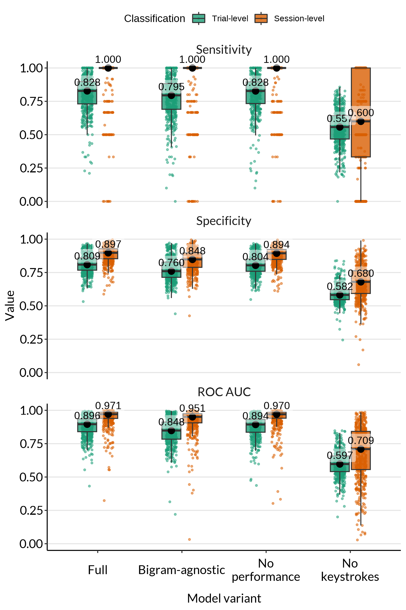
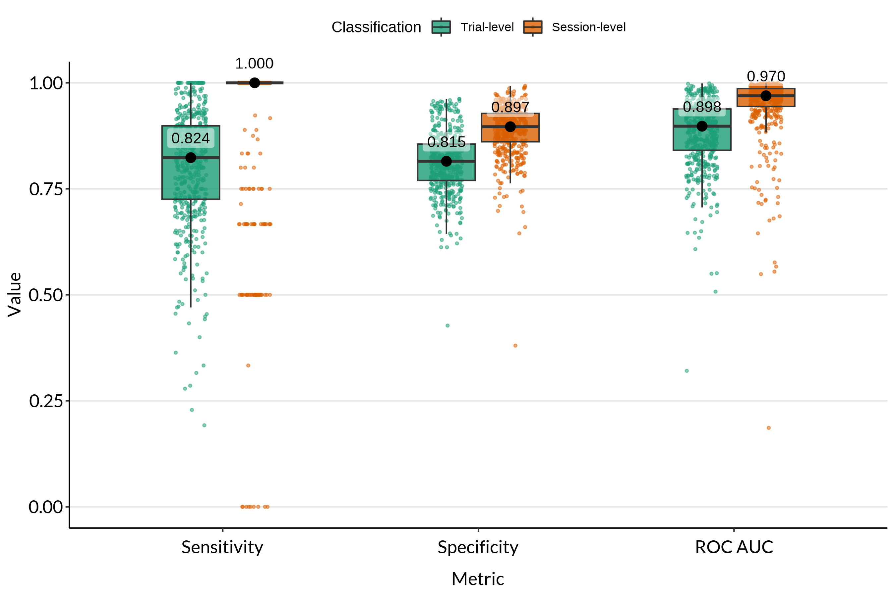
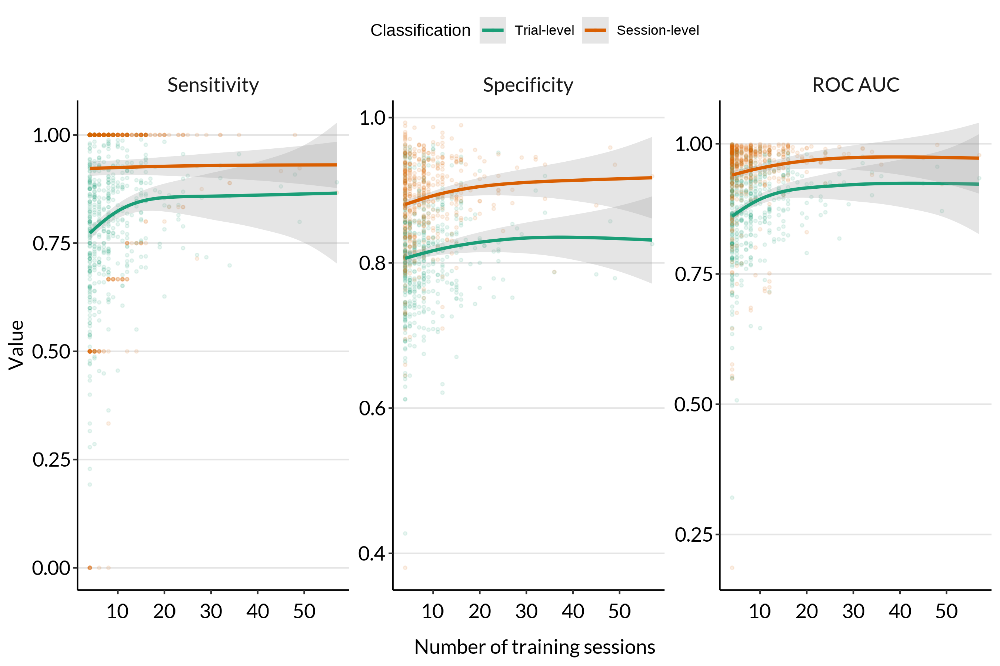
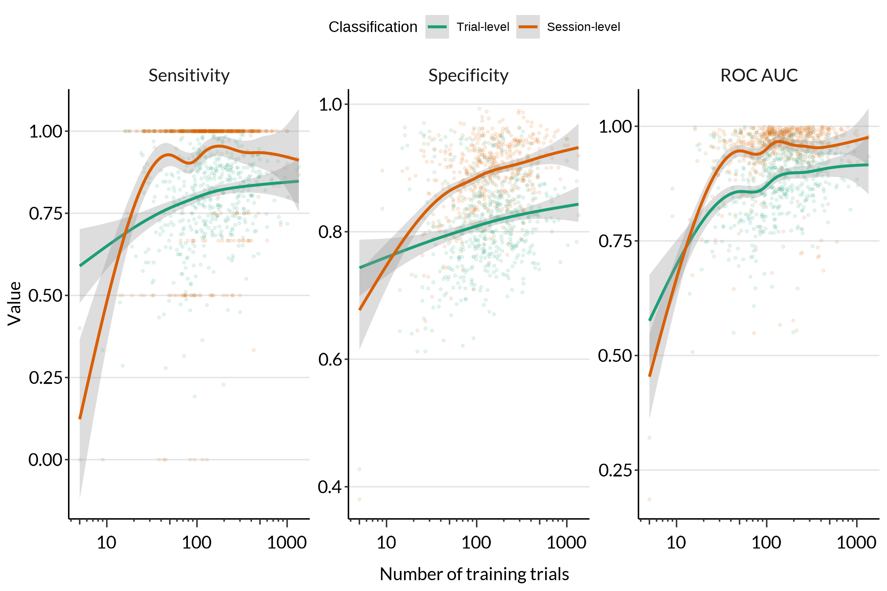
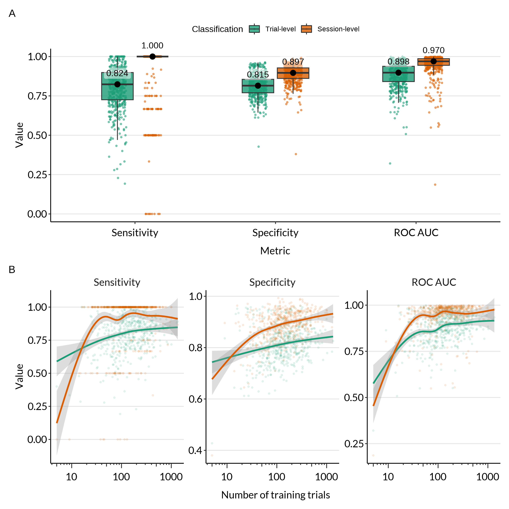
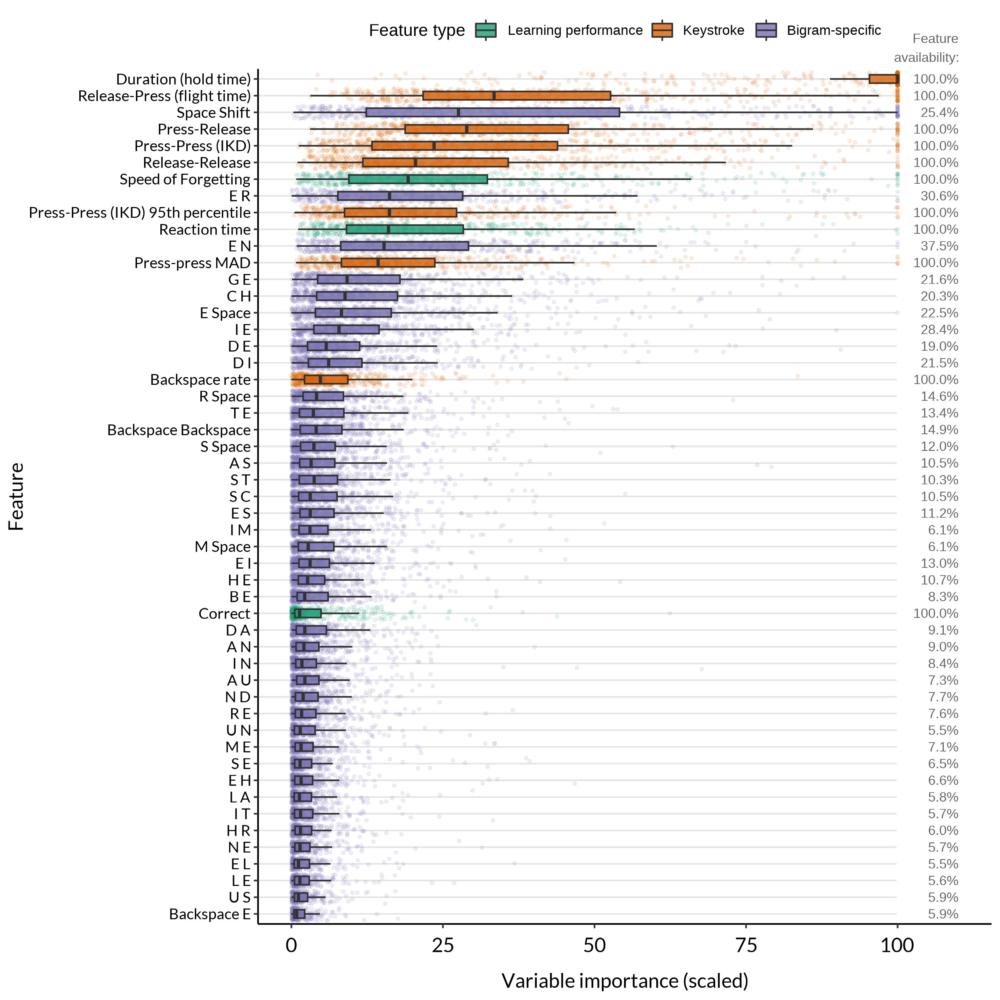
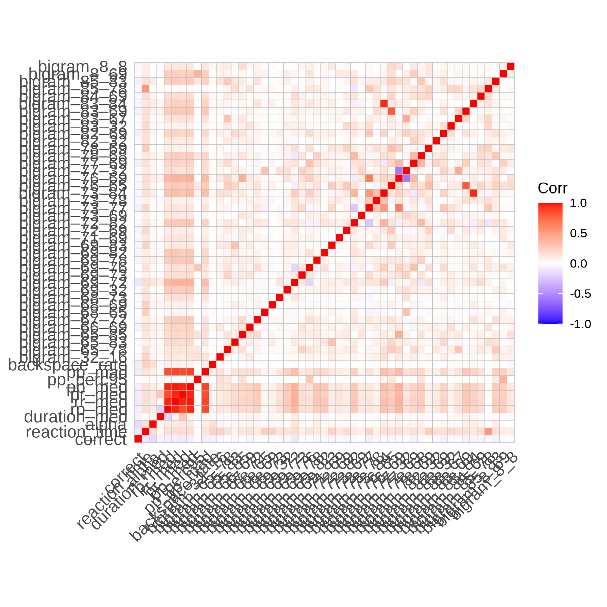

Evaluate XGBoost model fits
================
Last updated: 2025-02-20

- [Load fit metrics](#load-fit-metrics)
- [Performance metrics](#performance-metrics)
  - [How does performance change with the amount of training
    data?](#how-does-performance-change-with-the-amount-of-training-data)
  - [Combined metrics plot](#combined-metrics-plot)
- [Variable importance](#variable-importance)
- [Feature correlation](#feature-correlation)

``` r
library(here)
library(fst)
library(data.table)
library(dplyr)
library(purrr)
library(ggplot2)
library(stringr)
library(forcats)
library(patchwork)
library(ggcorrplot)
library(lmerTest)

source(here("scripts", "00_plotting_functions.R"))
```

## Load fit metrics

``` r
fits <- fread(here("data", "model_fits.csv"))
```

Also load feature data:

``` r
df <- read_fst(here("data", "response_features.fst"))
setDT(df)
```

## Performance metrics

All variants of the model:

``` r
metrics <- fits[, .(model_name, sens, spec, roc_auc, sens_session, spec_session, roc_auc_session)]
metrics_long <- melt(metrics, id.vars = "model_name", variable.name = "metric", value.name = "value")

# Identify trial-level vs. session-level metrics
metrics_long[, aggregation_level := ifelse(grepl("session", metric), "Session-level", "Trial-level")]
metrics_long[, aggregation_level := factor(aggregation_level, levels = c("Trial-level", "Session-level"))]
metrics_long[, metric := gsub("_session", "", metric)]

# Replace the model names with more descriptive ones
metrics_long[, model_name := factor(model_name, levels = c("only_keystroke", "only_performance", "bigram_agnostic", "full"),
                                    labels = c("No performance", "No keystrokes", "Bigram-agnostic", "Full"))]

# Change the order of the factor
metrics_long[, model_name := fct_relevel(model_name, "Full", "Bigram-agnostic", "No performance", "No keystrokes")]

# Replace the metric names with more descriptive ones
metrics_long[, metric := factor(metric, levels = c("sens", "spec", "roc_auc"),
                                labels = c("Sensitivity", "Specificity", "ROC AUC"))]

# Change the order of the factor
metrics_long[, metric := fct_relevel(metric, "Sensitivity", "Specificity", "ROC AUC")]

metrics_avg <- metrics_long[, .(value = median(value)), by = .(model_name, metric, aggregation_level)]

p_metrics_model_comparison <- ggplot(metrics_long, aes(x = model_name, y = value, group = interaction(model_name, metric, aggregation_level))) +
  facet_wrap(~ metric, ncol = 1) +
  geom_point(aes(colour = aggregation_level), alpha = .5, size = .75, position = position_jitterdodge(jitter.width = .25, dodge.width = .5)) +
  geom_boxplot(aes(fill = aggregation_level), width = .5, alpha = .8, outlier.shape = NA) +
  geom_point(data = metrics_avg, aes(x = model_name, y = value), size = 3, position = position_dodge(width = .5)) +
  geom_label(data = metrics_avg, aes(x = model_name, y = value, label = paste(format(round(value, 3), nsmall = 1))), vjust = -.15, position = position_dodge(width = .5), alpha = .5, label.size = 0) +
  scale_colour_brewer(palette = "Dark2") +
  scale_fill_brewer(palette = "Dark2") +
  scale_x_discrete(labels = function(x) str_wrap(x, width = 10)) +
  coord_cartesian(clip = "off") +
  labs(x = "Model variant",
       y = "Value",
       colour = "Classification",
       fill = "Classification") +
  theme_ml() +
  theme(legend.position = "top",
        strip.text = element_text(family = "Lato", size = 13, vjust = 1.5),
        strip.background = element_blank())

ggsave(plot = p_metrics_model_comparison, filename = here("output", "metrics_all_models.png"), width = 6, height = 9)
```



Are the differences between models statistically significant?

``` r
fits_stats <- copy(fits)
fits_stats[, model_name := factor(model_name, levels = c("only_keystroke", "only_performance", "bigram_agnostic", "full"),
                                    labels = c("No per- formance", "No key- strokes", "Bigram- agnostic", "Full"))]
fits_stats[, model_name := fct_relevel(model_name, "Full", "Bigram- agnostic", "No per- formance", "No key- strokes")]


# Sensitivity
lmer(sens_session ~ model_name + (1 | user_id), data = fits_stats) |>
  summary()
```

    ## Linear mixed model fit by REML. t-tests use Satterthwaite's method [
    ## lmerModLmerTest]
    ## Formula: sens_session ~ model_name + (1 | user_id)
    ##    Data: fits_stats
    ## 
    ## REML criterion at convergence: -76.6
    ## 
    ## Scaled residuals: 
    ##     Min      1Q  Median      3Q     Max 
    ## -3.6851 -0.1323  0.1020  0.4890  3.5205 
    ## 
    ## Random effects:
    ##  Groups   Name        Variance Std.Dev.
    ##  user_id  (Intercept) 0.01541  0.1241  
    ##  Residual             0.04489  0.2119  
    ## Number of obs: 2052, groups:  user_id, 513
    ## 
    ## Fixed effects:
    ##                              Estimate Std. Error         df t value Pr(>|t|)
    ## (Intercept)                 9.350e-01  1.084e-02  1.712e+03  86.239   <2e-16
    ## model_nameBigram- agnostic -2.698e-02  1.323e-02  1.536e+03  -2.039   0.0416
    ## model_nameNo per- formance  3.286e-03  1.323e-02  1.536e+03   0.248   0.8039
    ## model_nameNo key- strokes  -3.367e-01  1.323e-02  1.536e+03 -25.448   <2e-16
    ##                               
    ## (Intercept)                ***
    ## model_nameBigram- agnostic *  
    ## model_nameNo per- formance    
    ## model_nameNo key- strokes  ***
    ## ---
    ## Signif. codes:  0 '***' 0.001 '**' 0.01 '*' 0.05 '.' 0.1 ' ' 1
    ## 
    ## Correlation of Fixed Effects:
    ##             (Intr) md_B-a m_Np-f
    ## mdl_nmBgr-a -0.610              
    ## mdl_nmNpr-f -0.610  0.500       
    ## mdl_nmNky-s -0.610  0.500  0.500

``` r
# Specificity
lmer(spec_session ~ model_name + (1 | user_id), data = fits_stats) |>
  summary()
```

    ## Linear mixed model fit by REML. t-tests use Satterthwaite's method [
    ## lmerModLmerTest]
    ## Formula: spec_session ~ model_name + (1 | user_id)
    ##    Data: fits_stats
    ## 
    ## REML criterion at convergence: -4617.9
    ## 
    ## Scaled residuals: 
    ##     Min      1Q  Median      3Q     Max 
    ## -8.1371 -0.4256  0.0276  0.4896  4.8128 
    ## 
    ## Random effects:
    ##  Groups   Name        Variance Std.Dev.
    ##  user_id  (Intercept) 0.002882 0.05368 
    ##  Residual             0.004398 0.06632 
    ## Number of obs: 2052, groups:  user_id, 513
    ## 
    ## Fixed effects:
    ##                              Estimate Std. Error         df t value Pr(>|t|)
    ## (Intercept)                 8.863e-01  3.767e-03  1.393e+03 235.264   <2e-16
    ## model_nameBigram- agnostic -4.751e-02  4.141e-03  1.536e+03 -11.474   <2e-16
    ## model_nameNo per- formance -5.184e-03  4.141e-03  1.536e+03  -1.252    0.211
    ## model_nameNo key- strokes  -2.071e-01  4.141e-03  1.536e+03 -50.007   <2e-16
    ##                               
    ## (Intercept)                ***
    ## model_nameBigram- agnostic ***
    ## model_nameNo per- formance    
    ## model_nameNo key- strokes  ***
    ## ---
    ## Signif. codes:  0 '***' 0.001 '**' 0.01 '*' 0.05 '.' 0.1 ' ' 1
    ## 
    ## Correlation of Fixed Effects:
    ##             (Intr) md_B-a m_Np-f
    ## mdl_nmBgr-a -0.550              
    ## mdl_nmNpr-f -0.550  0.500       
    ## mdl_nmNky-s -0.550  0.500  0.500

``` r
# ROC AUC
lmer(roc_auc_session ~ model_name + (1 | user_id), data = fits_stats) |>
  summary()
```

    ## Linear mixed model fit by REML. t-tests use Satterthwaite's method [
    ## lmerModLmerTest]
    ## Formula: roc_auc_session ~ model_name + (1 | user_id)
    ##    Data: fits_stats
    ## 
    ## REML criterion at convergence: -2951.1
    ## 
    ## Scaled residuals: 
    ##     Min      1Q  Median      3Q     Max 
    ## -5.8747 -0.2147  0.0677  0.3666  3.0794 
    ## 
    ## Random effects:
    ##  Groups   Name        Variance Std.Dev.
    ##  user_id  (Intercept) 0.003259 0.05709 
    ##  Residual             0.011301 0.10631 
    ## Number of obs: 2052, groups:  user_id, 513
    ## 
    ## Fixed effects:
    ##                              Estimate Std. Error         df t value Pr(>|t|)
    ## (Intercept)                 9.485e-01  5.328e-03  1.780e+03 178.036  < 2e-16
    ## model_nameBigram- agnostic -2.567e-02  6.638e-03  1.536e+03  -3.867 0.000115
    ## model_nameNo per- formance -2.043e-03  6.638e-03  1.536e+03  -0.308 0.758287
    ## model_nameNo key- strokes  -2.690e-01  6.638e-03  1.536e+03 -40.528  < 2e-16
    ##                               
    ## (Intercept)                ***
    ## model_nameBigram- agnostic ***
    ## model_nameNo per- formance    
    ## model_nameNo key- strokes  ***
    ## ---
    ## Signif. codes:  0 '***' 0.001 '**' 0.01 '*' 0.05 '.' 0.1 ' ' 1
    ## 
    ## Correlation of Fixed Effects:
    ##             (Intr) md_B-a m_Np-f
    ## mdl_nmBgr-a -0.623              
    ## mdl_nmNpr-f -0.623  0.500       
    ## mdl_nmNky-s -0.623  0.500  0.500

Only the full model:

``` r
metrics <- fits[model_name == "full", .(roc_auc, sens, spec, roc_auc_session, sens_session, spec_session)]
metrics_long <- melt(metrics, measure.vars = 1:ncol(metrics), variable.name = "metric", value.name = "value")

# Identify trial-level vs. session-level metrics
metrics_long[, aggregation_level := ifelse(grepl("session", metric), "Session-level", "Trial-level")]
metrics_long[, aggregation_level := factor(aggregation_level, levels = c("Trial-level", "Session-level"))]
metrics_long[, metric := gsub("_session", "", metric)]

# Replace the metric names with more descriptive ones
metrics_long[, metric := factor(metric, levels = c("sens", "spec", "roc_auc"),
                                labels = c("Sensitivity", "Specificity", "ROC AUC"))]

# Change the order of the factor
metrics_long[, metric := fct_relevel(metric, "Sensitivity", "Specificity", "ROC AUC")]

metrics_avg <- metrics_long[, .(value = median(value)), by = .(metric, aggregation_level)]


p_metrics <- ggplot(metrics_long, aes(x = metric, y = value, group = interaction(metric, aggregation_level))) +
  geom_point(aes(colour = aggregation_level), alpha = .5, size = .75, position = position_jitterdodge(jitter.width = .25, dodge.width = .5)) +
  geom_boxplot(aes(fill = aggregation_level), width = .5, alpha = .8, outlier.shape = NA) +
  geom_point(data = metrics_avg, aes(x = metric, y = value), size = 3, position = position_dodge(width = .5)) +
  geom_label(data = metrics_avg, aes(x = metric, y = value, label = paste(format(round(value, 3), nsmall = 1))), vjust = -.5, position = position_dodge(width = .5), alpha = .5, label.size = 0) +
  scale_colour_brewer(palette = "Dark2") +
  scale_fill_brewer(palette = "Dark2") +
  coord_cartesian(clip = "off") +
  labs(x = "Metric",
       y = "Value",
       colour = "Classification",
       fill = "Classification") +
  theme_ml() +
  theme(legend.position = "top")

ggsave(plot = p_metrics, filename = here("output", "metrics_boxplot.png"), width = 9, height = 6)
```



### How does performance change with the amount of training data?

``` r
metrics_by_user <- fits[model_name == "full", .(user_id, n_sessions_train, n_trials_train, roc_auc, sens, spec, roc_auc_session, sens_session, spec_session)]

metrics_by_user_long <- melt(metrics_by_user, id.vars = c("user_id", "n_sessions_train", "n_trials_train"), measure.vars = 4:ncol(metrics_by_user), variable.name = "metric", value.name = "value")

# Identify trial-level vs. session-level metrics
metrics_by_user_long[, aggregation_level := ifelse(grepl("session", metric), "Session-level", "Trial-level")]
metrics_by_user_long[, aggregation_level := factor(aggregation_level, levels = c("Trial-level", "Session-level"))]
metrics_by_user_long[, metric := gsub("_session", "", metric)]

# Replace the metric names with more descriptive ones
metrics_by_user_long[, metric := factor(metric, levels = c("roc_auc", "sens", "spec"),
                                labels = c("ROC AUC", "Sensitivity", "Specificity"))]

# Change the order of the factor
metrics_by_user_long[, metric := fct_relevel(metric, "Sensitivity", "Specificity", "ROC AUC")]

p_metrics_by_session <- ggplot(metrics_by_user_long, aes(x = n_sessions_train, y = value, group = interaction(metric, aggregation_level))) +
  facet_wrap(~metric, scales = "free_y") +
  geom_point(aes(colour = aggregation_level), alpha = .1, size = .75) +
  geom_smooth(aes(colour = aggregation_level), method = "gam", se = TRUE, alpha = .25) +
  scale_colour_brewer(palette = "Dark2") +
  labs(x = "Number of training sessions",
       y = "Value",
       colour = "Classification") +
  theme_ml() +
  theme(legend.position = "top",
        strip.text = element_text(family = "Lato", size = 13))


ggsave(plot = p_metrics_by_session, filename = here("output", "metrics_by_training_sessions.png"), width = 9, height = 6)
```

    ## `geom_smooth()` using formula = 'y ~ s(x, bs = "cs")'



Also plot as a function of the number of training trials:

``` r
p_metrics_by_trials <- ggplot(metrics_by_user_long, aes(x = n_trials_train, y = value, group = interaction(metric, aggregation_level))) +
  facet_wrap(~metric, scales = "free_y") +
  geom_point(aes(colour = aggregation_level), alpha = .1, size = .75) +
  geom_smooth(aes(colour = aggregation_level), method = "gam", se = TRUE, alpha = .33) +
  scale_colour_brewer(palette = "Dark2") +
  scale_x_log10(guide = "axis_logticks") +
  labs(x = "Number of training trials",
       y = "Value",
       colour = "Classification") +
  theme_ml() +
  theme(legend.position = "top",
        strip.text = element_text(family = "Lato", size = 13))

ggsave(plot = p_metrics_by_trials, filename = here("output", "metrics_by_training_trials.png"), width = 9, height = 6)
```

    ## `geom_smooth()` using formula = 'y ~ s(x, bs = "cs")'



### Combined metrics plot

``` r
p_metrics_combined <- p_metrics / p_metrics_by_trials + guides(colour = "none", fill = "none") + plot_annotation(tag_levels = "A")

ggsave(plot = p_metrics_combined, filename = here("output", "metrics_combined.png"), width = 6, height = 9)
```

    ## `geom_smooth()` using formula = 'y ~ s(x, bs = "cs")'



## Variable importance

For each user-specific model, variable importance was calculated and
scaled so that the most important variable has a value of 100. We can
calculate average variable importance across all users.

``` r
# Select all feature columns
vimp_cols <- setdiff(names(fits), c(names(metrics), "model_name", "n_sessions_train", "n_trials_train", "bal_accuracy", "bal_accuracy_session"))

vimp <- fits[model_name == "full", ..vimp_cols]
vimp_long <- melt(vimp, id.vars = "user_id", variable.name = "variable", value.name = "importance")

# Add a column for the availability (%) of this feature in df
feature_availability <- df[, .(variable = vimp_cols, feature_availability = scales::label_percent(accuracy = .1)(colMeans(!is.na(.SD)))), .SDcols = vimp_cols]
vimp_long <- merge(vimp_long, feature_availability, by = "variable")

# Categorise variables into feature types:
# - Learning performance features: correct, reaction_time, alpha
# - Keystroke features: duration_med, rp_med, rr_med, pr_med, pp_med, pp_perc95, pp_mad, backspace_rate
# - Bigram-specific features: bigram_*
vimp_long[, feature_type := case_when(
  grepl("correct|reaction_time|alpha", variable) ~ "Learning performance",
  grepl("duration_med|rp_med|rr_med|pr_med|pp_med|pp_perc95|pp_mad|backspace_rate", variable) ~ "Keystroke",
  grepl("bigram_", variable) ~ "Bigram-specific",
  TRUE ~ "Other"
)]

# Replace learning performance features by more descriptive names
vimp_long[feature_type == "Learning performance", variable := case_when(
  variable == "correct" ~ "Correct",
  variable == "reaction_time" ~ "Reaction time",
  variable == "alpha" ~ "Speed of Forgetting"
)]

# Replace keystroke features by more descriptive names
vimp_long[feature_type == "Keystroke", variable := case_when(
  variable == "duration_med" ~ "Duration (hold time)",
  variable == "rp_med" ~ "Release-Press (flight time)",
  variable == "rr_med" ~ "Release-Release",
  variable == "pr_med" ~ "Press-Release",
  variable == "pp_med" ~ "Press-Press (IKD)",
  variable == "pp_perc95" ~ "Press-Press (IKD) 95th percentile",
  variable == "pp_mad" ~ "Press-press MAD",
  variable == "backspace_rate" ~ "Backspace rate"
)]

# For bigram-specific features, we can replace the numeric Unicode values by the actual bigram: bigram_69_82 -> "E R"
print_bigram <- function (x) {
  
  # Non-printable characters are replaced by their title
  print_char <- function (char) {
    char <- case_when(
      char == 8 ~ "Backspace",
      char == 13 ~ "Enter",
      char == 16 ~ "Shift",
      char == 17 ~ "Ctrl",
      char == 20 ~ "CapsLock",
      char == 32 ~ "Space",
      TRUE ~ intToUtf8(char)
    )
  }
  
  char1 <- str_extract(x, "\\d+") |>
    as.numeric() |>
    print_char()
  
  char2 <- str_extract(x, "\\d+$") |>
    as.numeric() |>
    print_char() 

  paste0(char1, " ", char2)
}

vimp_long[feature_type == "Bigram-specific", variable := map_chr(variable, print_bigram)]

# Reorder the feature type levels
vimp_long[, feature_type := factor(feature_type, levels = c("Learning performance", "Keystroke", "Bigram-specific"))]

# How often is each feature available in the data?
vimp_feature_availability <- vimp_long[, .(feature_availability = feature_availability[1]), by = .(variable, feature_type)]

p_vimp <- ggplot(vimp_long[!is.na(importance)], aes(x = reorder(variable, (importance)), y = importance)) +
  geom_rect(data = NULL, aes(xmin = -Inf, xmax = Inf, ymin = 100, ymax = Inf), fill = "white", colour = "white") +
  geom_jitter(aes(colour = feature_type), alpha = .1, size = .75) +
  geom_boxplot(aes(fill = feature_type), width = .5, alpha = .8, outlier.shape = NA) +
  annotate("text", x = Inf, y = 110, label = "Feature\navailability:", hjust = 1, vjust = -.25, size = rel(3), colour = "grey40") +
  geom_text(data = vimp_feature_availability, aes(y = 115, x = variable, label = feature_availability), hjust = 1, vjust = .5, size = rel(3), colour = "grey40") +
  labs(x = "Feature",
       y = "Variable importance (scaled)",
       title = "\n",
       colour = "Feature type",
       fill = "Feature type") +
  scale_y_continuous(limits = c(0, 115), breaks = seq(0, 100, 25)) +
  scale_colour_brewer(palette = "Dark2") +
  scale_fill_brewer(palette = "Dark2") +
  coord_flip(clip = "off") +
  theme_ml() +
  theme(axis.text.y = element_text(size = rel(.75)),
        legend.position = c(1, 1),
        legend.justification = c(1.2, 0),
        legend.direction = "horizontal")

ggsave(plot = p_vimp, filename = here("output", "variable_importance.png"), width = 6, height = 9)
```



## Feature correlation

Pairwise correlation between the features in the data:

``` r
p_corr <- cor(df[, -c("response_id", "user_id", "session_id")], use = "pairwise.complete.obs") |>
  ggcorrplot()

ggsave(plot = p_corr, filename = here("output", "feature_correlation.png"), width = 6, height = 6)
```


